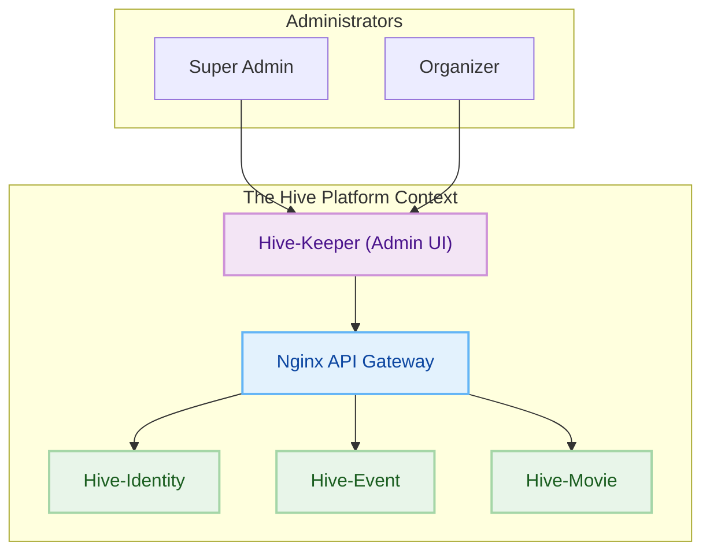
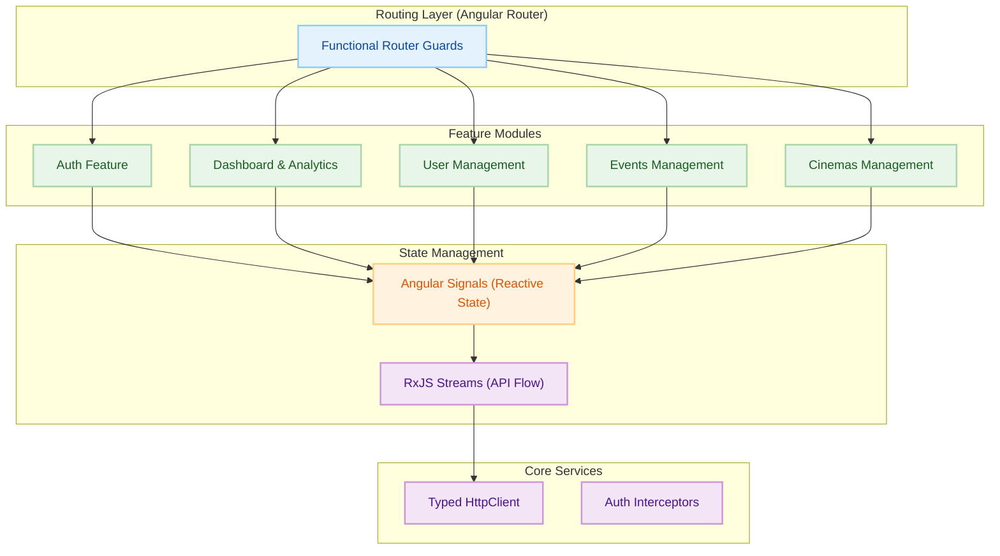
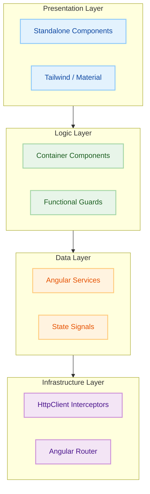

<p align="center">

</p>

<h1 align="center">Hive-Keeper (Admin UI)</h1>

<p align="center"><em>The mission-critical administrative command center for the Hive ecosystem, providing unified control over users, events, cinemas, and platform-wide analytics.</em></p>

<p align="center">


</p>

---

> **Hive-Keeper** is the internal management portal for the Hive platform. Built with **Angular 21** and **TypeScript**, it empowers platform administrators and organizers to manage the entire lifecycle of events, movies, and users through a high-performance, accessible, and reactive interface.

---

### 🔗 Associated Repositories

- 👉 **[The-Hive-Project (Main Hub)](https://github.com/Naveen2070/The-Hive-Project)**
- 👉 **[Hive-Identity (Auth Service)](https://github.com/Naveen2070/The-Hive-Project/tree/main/services/identity-service)**
- 👉 **[Hive-Event (Core API)](https://github.com/Naveen2070/The-Hive-Project/tree/main/services/core-api)**
- 👉 **[Hive-Movie (Ticketing Service)](https://github.com/Naveen2070/The-Hive-Project/tree/main/services/movie-service)**
- 👉 **[Hive-Forager (Consumer UI)](https://github.com/Naveen2070/The-Hive-Project/tree/main/services/frontend)**

---

## 🚀 Key Features

- **👤 Unified User Management:** Full control over the user lifecycle, including registration, role provisioning (RBAC), and account moderation (Ban/Unban).
- **📅 Event Orchestration:** Comprehensive tools for organizers to create and manage multi-tier events, track ticket allocations, and monitor live check-ins.
- **🎬 Cinema & Movie Catalog:** Administrative suite for managing cinema multiplexes, auditorium layouts (including binary seat mapping), and movie listings.
- **📊 Real-time Analytics:** Interactive dashboards featuring revenue trends, sales growth metrics, and transaction history powered by reactive signals.
- **🛡️ Multi-Tenant RBAC:** Granular access control based on domain roles (`events`, `movies`, `identity`), ensuring secure separation of concerns for different administrative levels.
- **⚡ Reactive Architecture:** Leverages **Angular Signals** for highly performant state management and seamless UI updates.
- **♿ Accessibility First:** Built with **Angular Material** and **Tailwind CSS v4**, complying with WCAG AA standards for an inclusive administrative experience.

---

## 🛠️ Tech Stack

- **Core Framework:** Angular 21 (Standalone Components)
- **Language:** TypeScript 5.9
- **State Management:** Angular Signals
- **UI Components:** Angular Material 21, Angular CDK
- **Styling:** Tailwind CSS v4 (PostCSS plugin)
- **HTTP Client:** Typed HttpClient with RxJS 7.8
- **Testing:** Vitest
- **Formatting:** Prettier

---

## 🏗️ Architecture

The project follows a **Smart/Dumb Component Architecture** combined with a feature-driven folder structure.

### High-Level Ecosystem



### Component Architecture



### Layered Architecture (Internal)



---

## 📂 Project Structure

```text
src/app/
├── core/                 # App-wide singleton logic
│   ├── interceptors/     # HTTP Auth & Mock interceptors
│   ├── mocks/            # Mock data for offline development
│   └── models/           # Global interfaces & API models
├── shared/               # Reusable UI components
│   ├── components/       # Layout, Sidebar, Dialogs, etc.
├── features/             # Domain-specific modules
│   ├── auth/             # Authentication & Security
│   │   ├── components/   # Login containers & views
│   │   ├── guards/       # Auth & Role guards
│   │   ├── models/       # Auth-specific interfaces
│   │   ├── services/     # Auth & Token management
│   │   └── routes.ts     # Auth route definitions
│   ├── dashboard/        # Analytics & Overview
│   │   ├── components/   # Dashboard widgets & charts
│   │   ├── services/     # Dashboard data fetching
│   │   └── routes.ts     # Dashboard route definitions
│   ├── users/            # User & Role Management
│   │   ├── components/   # User list & Management dialogs
│   │   └── services/     # User API communication
│   ├── events/           # Event & Ticket Management
│   │   ├── components/   # Event list & Booking dialogs
│   │   └── services/     # Event & Booking API services
│   └── cinemas/          # Cinema & Auditorium Management
│       ├── components/   # Cinema management & layouts
│       └── services/     # Cinema API services
├── app.routes.ts         # Root route definitions
├── app.config.ts         # Global configuration (Providers)
└── main.ts               # Application entry point
```

---

## ⚙️ Getting Started (How to Run)

### Prerequisites

- **Node.js 22+**
- **npm 11+**

### 1. Clone the Repository

```bash
git clone https://github.com/Naveen2070/The-Hive-Project.git
cd services/admin-ui
```

### 2. Install Dependencies

```bash
npm install
```

### 3. Development Server

Run `ng serve` for a dev server. Navigate to `http://localhost:4200/`. The app will automatically reload if you change any of the source files.

### 4. Build

Run `ng build` to build the project. The build artifacts will be stored in the `dist/` directory.

### 5. Running Tests

To execute unit tests with **Vitest**, run:

```bash
npm test
```

---

## 🔌 Page & Route Overview

| Path                  | Description                       | Access          |
| :-------------------- | :-------------------------------- | :-------------- |
| `/login`              | Administrative Authentication     | Public          |
| `/dashboard/overview` | Platform Revenue & Stats Overview | Organizer/Admin |
| `/dashboard/users`    | Global User & Role Management     | Super Admin     |
| `/cinemas`            | Cinema & Auditorium Orchestration | Organizer/Admin |
| `/events`             | Event & Ticket Tier Management    | Organizer/Admin |

---

<p align="center">
Built with ❤️, 🅰️, and the modern Angular ecosystem. 🚀<br>
<b>Architected and maintained by <a href="https://github.com/Naveen2070">Naveen</a></b>
</p>
